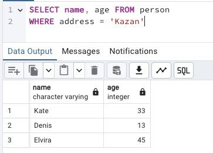

## Task

+ **Please make a SELECT statement which returns all person's names and person's ages from the city ‘Kazan’.**

RU: Cделайте запрос SELECT, в котором будут указаны имена и возраст всех пользователей из города ‘Казань’.

\
*Схематичное представление БД*

\
*Таблица Person*

\
*Решение*