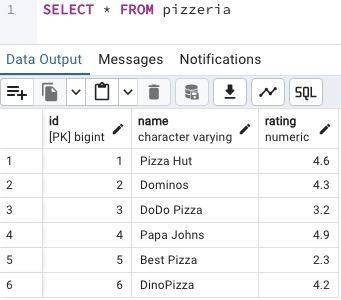
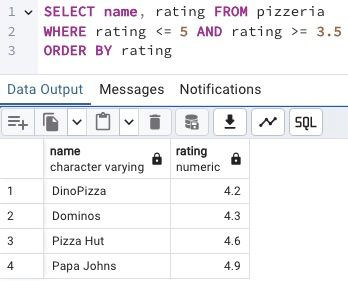
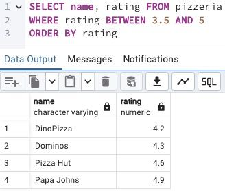

## Task

+ **Please make 2 syntax different SELECT statements which return a list of pizzerias (`pizzeria name` and `rating`) with rating between 3.5 and 5 points (including limit points) and ordered by pizzeria rating.**
+ **the 1st SELECT statement must contain comparison signs  (<=, >=);**
+ **the 2nd SELECT statement must contain BETWEEN keyword.**

RU: Пожалуйста, составьте 2 инструкции SELECT с разным синтаксисом, которые возвращают список пиццерий (название пиццерии и рейтинг) с рейтингом от 3,5 до 5 баллов (включая предельные баллы) и упорядоченных по рейтингу пиццерий.
+ 1-я инструкция SELECT должна содержать знаки сравнения (<=, >=).;
+ 2-й оператор SELECT должен содержать ключевое слово BETWEEN.

\
*Схематичное представление БД*

\
*Таблица Pizzeria*

\
*Решение со знаками сравнения*

\
*Решение через ключевое слово BETWEEN*
