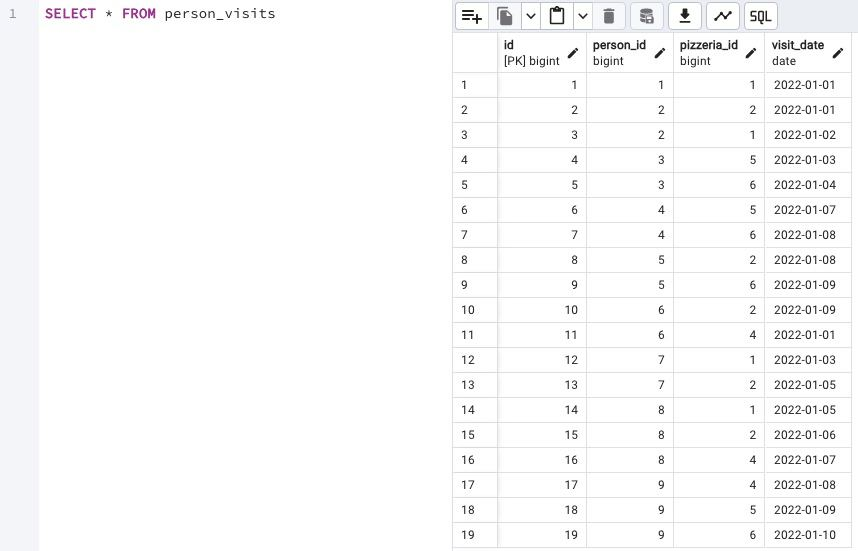
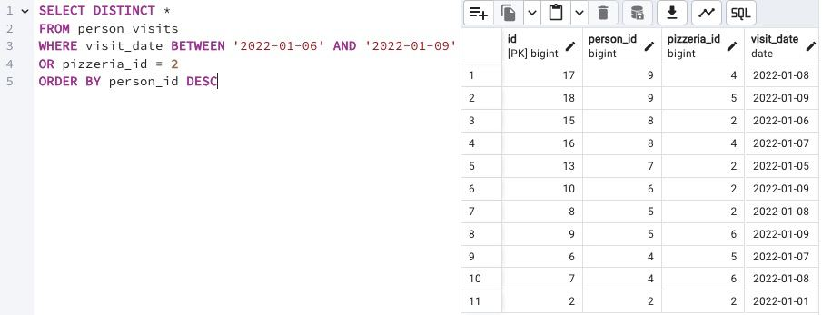
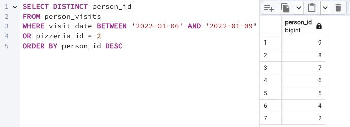

## Task

+ **Please make a SELECT statement that returns the `person identifiers` (without duplicates) who visited pizzerias in a period from January 6, 2022 to January 9, 2022 (including all days) or visited pizzerias with identifier 2. Also include ordering clause by person identifier in descending mode.**

RU: Создайте запрос SELECT, в котором будут указаны идентификаторы пользователей (без дублирования), которые посещали пиццерии в период с 6 по 9 января 2022 года (включая все дни) или посещали пиццерии с идентификатором 2. Также включите предложение о упорядочении по идентификатору пользователя в режиме убывания.

\
*Схематичное представление БД*

\
*Таблица Person Visits*

\
*Почти готовый вариант, чтобы свериться по оставшимся столбцам*

\
*Решение*
