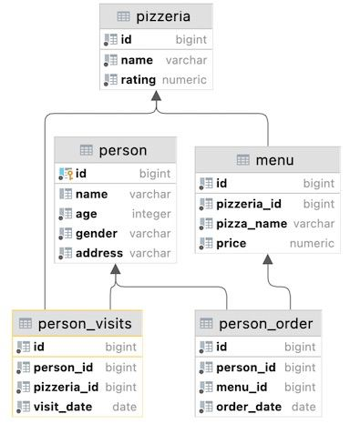
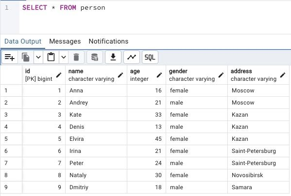
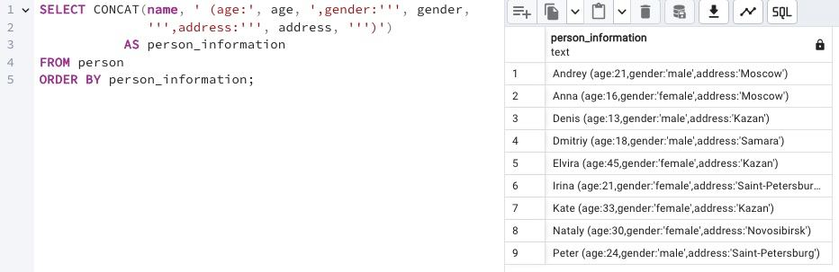

## Task

+ **Please make a SELECT statement which returns one calculated field with name `person_information` in one string like described in the next sample:**

>Anna (age:16,gender:'female',address:'Moscow')

+ **Finally, please add the ordering clause by calculated column in ascending mode.**
+ **Please pay attention to the quotation marks in your formula!**

RU: Создайте запрос SELECT, который возвращает одно поле с названием `person_information` в одной строке, как описано в примере. Добавьте сортировку в порядке возрастания по заполняемому столбцу person_information. Обратите внимание на кавычки в формуле!

\
*Схематичное представление БД*

\
*Таблица Person*

\
*Решение*

