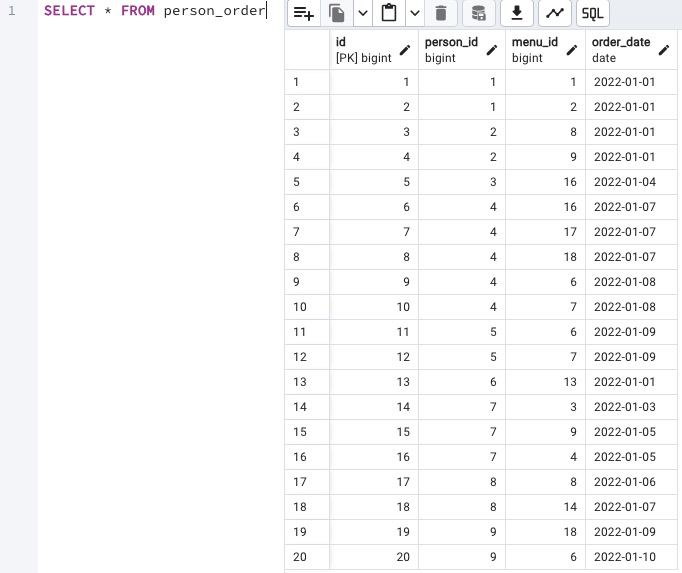
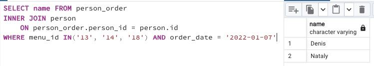
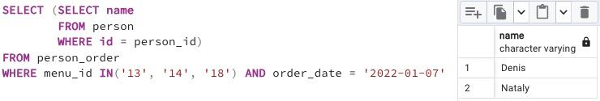

## Task

+ **Write a SELECT statement that returns the names of people (based on an internal query in the SELECT clause) who placed orders for the menu with identifiers 13, 14, and 18, and the date of the orders should be January 7, 2022. Be careful with "Denied Section" before your work. Please take a look at the pattern of internal query.**

```
SELECT 
    (SELECT ... ) AS NAME  -- this is an internal query in a main SELECT clause
FROM ...
WHERE ...
```

RU: Напишите инструкцию SELECT, которая возвращает имена людей (на основе внутреннего запроса в пункте SELECT), которые размещали заказы на меню с идентификаторами 13, 14 и 18, и датой заказа должно быть 7 января 2022 года. Будьте внимательны с разделом "Отказано" перед началом работы. Пожалуйста, взгляните на схему внутреннего запроса.

\
*Схематичное представление БД*

\
*Таблица Person Order*

\
*Мой вариант решения (покороче)*

\
*Решение по заданной схеме*