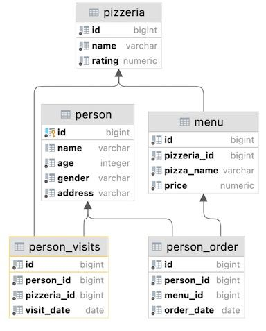
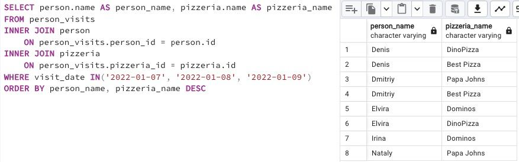

## Task

+ **Use the SQL construction from Exercise 05 and add a new calculated column (use column name `check_name`) with a check statement a pseudocode for this check is given below in the SELECT clause.**

```
if (person_name == 'Denis') then return true
    else return false
```

RU: Используйте конструкцию SQL из упражнения 05 и добавьте новый вычисляемый столбец (используйте имя столбца `check_name`) с оператором проверки. Псевдокод для этой проверки в примере выше.

\
*Схематичное представление БД*

\
*Решение*