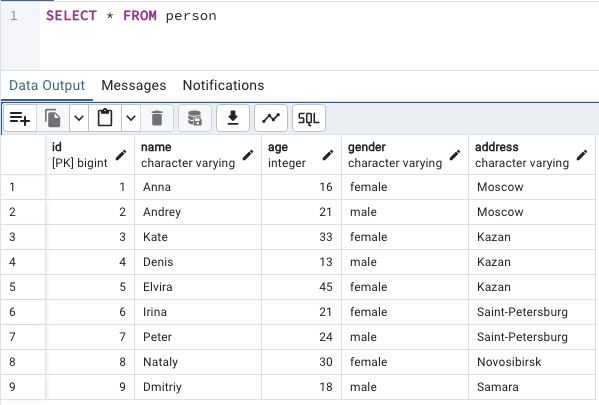

## Task

+ **Let's apply data intervals to the `person table`. Please make an SQL statement that returns the `identifiers of a person`, the `person's names`, and the `interval of the person's ages` (set a name of a new calculated column as 'interval_info') based on the pseudo code below.**

```
if (age >= 10 and age <= 20) then return 'interval #1'
else if (age > 20 and age < 24) then return 'interval #2'
else return 'interval #3'
```

+ **Sort a result by `interval_info` column in ascending mode.**

RU: Создать SQL-скрипт, который возвращает id человека, имя человека и интервал (в который входит возраст) (в новой колонке interval_info), на основании псевдокода из примера

\
*Схематичное представление БД*

\
*Таблица Person*

\
*Решение*