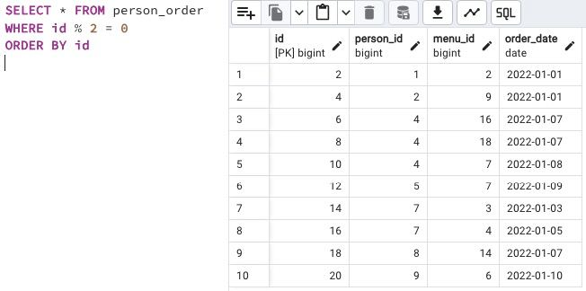

## Task

+ **Create an SQL statement that returns all columns from the `person_order` table with rows whose identifier is an even number. The result must be ordered by the returned identifier.**

RU: Создайте SQL-скрипт, который возвращает все столбцы из таблицы `person_order` со строками, идентификатором которых является четное число. Результат нужно упорядочить по возвращаемому идентификатору.

\
*Схематичное представление БД*

\
*Таблица Person Order*

\
*Решение*