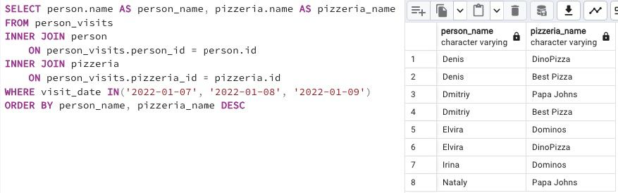
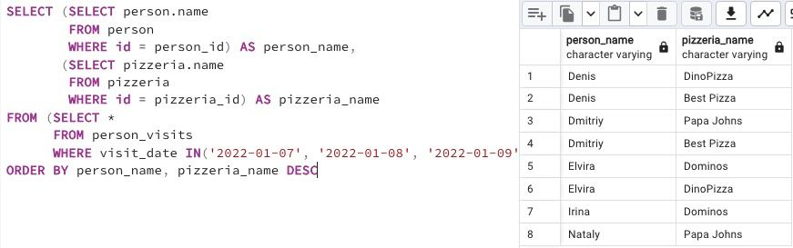

## Task

+ **Please make a SELECT statement that returns `person names` and `pizzeria names` based on the `person_visits` table with a visit date in a period from January 07 to January 09, 2022 (including all days) (based on an internal query in the `FROM' clause). Please take a look at the pattern of the final query.**

```
SELECT (...) AS person_name ,  -- this is an internal query in a main SELECT clause
        (...) AS pizzeria_name  -- this is an internal query in a main SELECT clause
FROM (SELECT … FROM person_visits WHERE …) AS pv -- this is an internal query in a main FROM clause
ORDER BY ...
```

+ **Please add a ordering clause by `person name` in ascending mode and by `pizzeria name` in descending mode.**

RU: Создайте запрос SELECT, который возвращает имена посетителей и названия пиццерий на основе таблицы person_visits с указанием даты посещения в период с 7 по 9 января 2022 года (включая все дни), на основе внутреннего запроса в разделе FROM. Добавьте сортировку по имени пользователя в порядке возрастания и по названию пиццерии в порядке убывания.

\
*Схематичное представление БД*

\
*Решение*

\
*Второй вариант решения*