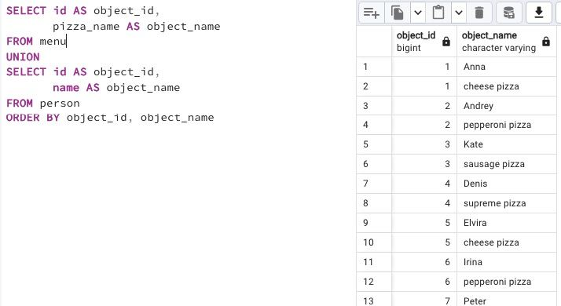

## Task

**Please write a SQL statement that returns the `menu identifier` and `pizza names` from the `menu` table and the `person identifier` and person `name` from the `person table` in one global list (with column names as shown in the example below) ordered by `object_id` and then by `object_name` columns.**

RU: Напишите инструкцию SQL, которая возвращает `menu identifier` и `pizza names` из таблицы`menu`, а также `person identifier` и `name` из таблицы `person table` в одном глобальном списке (с именами столбцов, как показано в примере ниже), упорядоченном по `object_id`, а затем по столбцам `object_name`.

\
*Схема*

\
*Решение*