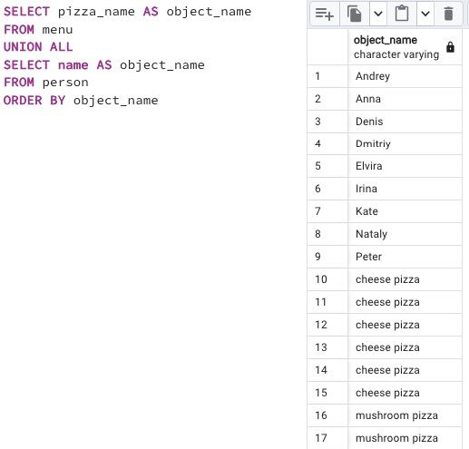

## Task - UNION dance with subquery

**Please modify an SQL statement from "Exercise 00" by removing the object_id column. Then change the order by object_name for part of the data from the person table and then from the menu table (as shown in an example below). Please save duplicates!**

RU: Измените инструкцию из ex00, удалив столбец object_id. Затем измените порядок `object_name` для части данных из таблицы `person`, а затем из таблицы `menu`. Сохраните повторяющиеся данные.

\
*Схема*

\
*Решение*
