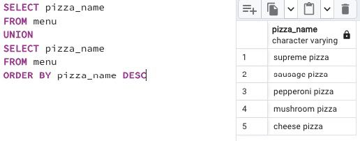

## Task -  Duplicates or not duplicates

**Write an SQL statement that returns unique `pizza names` from the `menu` table and sorts them by the `pizza_name` column in descending order. Please note the Denied section.**

RU: Напишите инструкцию SQL, которая вернет уникальные `pizza_names` из таблицы `menu` и сортирует их в порядке убывания. Обратите внимание на раздел `denied`.

\
*Схема*

\
*Решение*