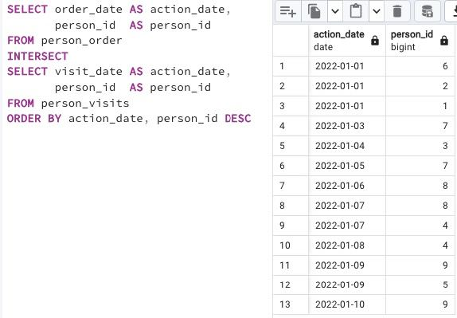

## Task - “Hidden” Insights

**Write an SQL statement that returns common rows for attributes order_date, person_id from the person_order table on one side and visit_date, person_id from the person_visits table on the other side (see an example below). In other words, let's find the identifiers of persons who visited and ordered a pizza on the same day. Actually, please add the order by action_date in ascending mode and then by person_id in descending mode.**

RU: Напишите инструкцию SQL, которая возвращает общие строки для `order_date`, `person_id` из таблицы `person_order` с одной стороны и `visit_date`, `person_id` из таблицы `person_visits` с другой. Другими словами, надо найти идентификаторы людей, которые посетили пиццу и заказали ее в один и тот же день. Сделать сортировку по `action_date` и затем по `person_id` DESC.

\
*Схема*

\
*Решение*
