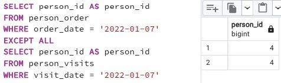

## Task - Difference? Yep, let's find the difference between multisets.

**Please write a SQL statement that returns a difference (minus) of person_id column values while saving duplicates between person_order table and person_visits table for order_date and visit_date are for January 7, 2022.**

RU: Напишите SQL-инструкцию, которая возвращает разницу значений `person_id` при сохранении дубликатов между таблицей `person_order` и `person_visits` для `order_date` и `visit_date` для 7-01-2022 

\
*Схема*

\
*Решение*