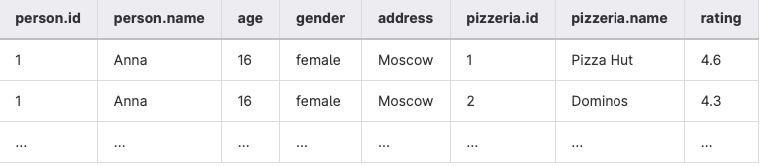
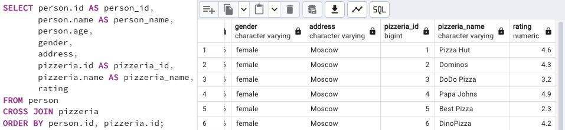

## Task - Did you hear about Cartesian Product?

**Please write a SQL statement that returns all possible combinations between person and pizzeria tables, and please set the order of the person identifier columns and then the pizzeria identifier columns. Please take a look at the sample result below. Please note that the column names may be different for you.**

RU: Напишите SQL-инструкцию, которая возвращает все возможные комбинации между таблицами `person` и `pizzeria`. Добавьте установите сортировку по `person id` и затем по `pizzeria_id`. 

\
*Пример*

\
*Схема*

\
*Решение*