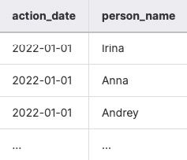
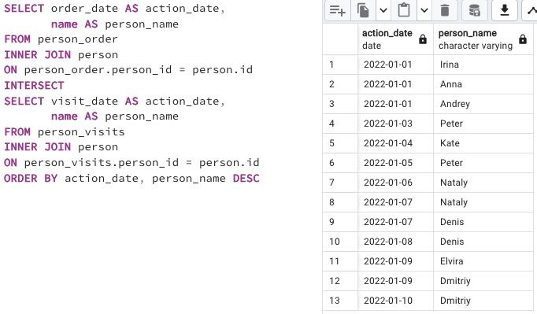

## Task - Lets see on “Hidden” Insights

**Let's go back to Exercise #03 and modify our SQL statement to return `person names` instead of `person identifiers` and change the order by `action_date` in ascending mode and then by `person_name` in descending mode. Take a look at the sample data below.**

RU: Измените инструкцию SQL из ex03, чтобы она возвращала имена людей вместо идентификаторов, сделайте сортировку по `action_date` в порядке возрастания, а затем по `person_name` в порядке убывания.

\
*Пример*

\
*Схема*

\
*Решение*
