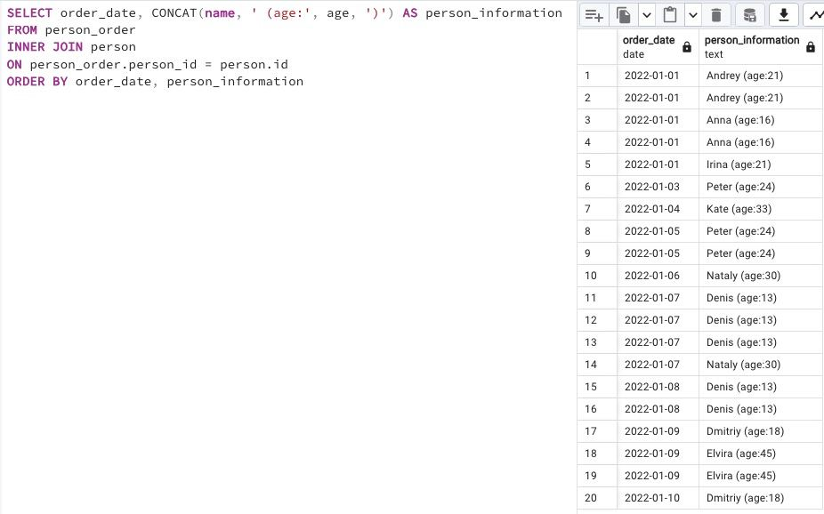

## Task - Just make a JOIN

**Write an SQL statement that returns the order date from the `person_order` table and the corresponding `person name` (name and age are formatted as in the data sample below) who made an order from the `person table`. Add a sort by both columns in ascending order.**

RU: Напишите SQL-инструкцию, которая возвращает дату заказа из таблицы `person_order` и соответствующее `person_name` (формат должен быть как в примере), который сделал заказ из таблицы `person`. Добавьте сортировку по обоим столбцам в порядке возрастания.

\
*Пример*

\
*Схема*

\
*Решение*