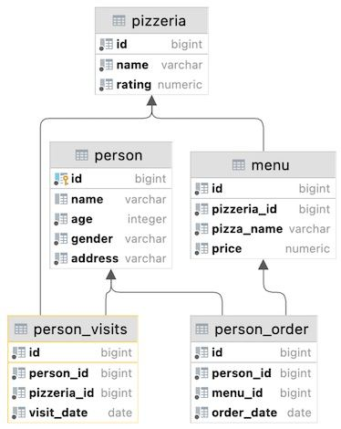
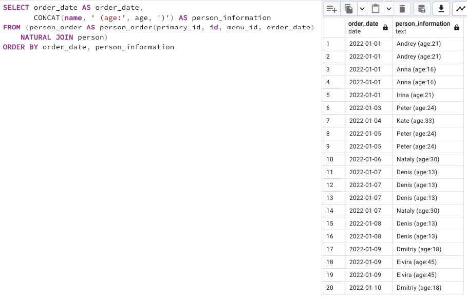

## Task - Migrate JOIN to NATURAL JOIN

**Please rewrite a SQL statement from Exercise #07 by using NATURAL JOIN construction. The result must be the same like for Exercise #07.**

RU: Перепишите SQL-инструкцию из ex07, используя `NATURAL JOIN`.

\
*Схема*

\
*Решение*