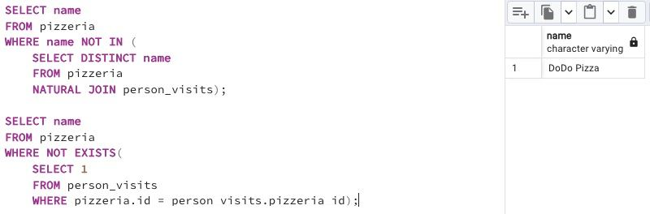

## Task - IN versus EXISTS

**Write 2 SQL statements that return a list of pizzerias that have not been visited by people using IN for the first and EXISTS for the second.**

RU: Напишите 2 SQL-инструкции, которые возвращают список пиццерий, которые не посещали люди, используя `IN` для первой инструкции и `EXISTS` для второй инструкции.

\
*Схема*

\
*Решение*