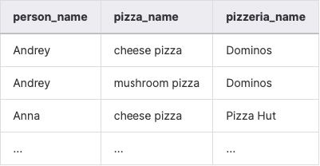
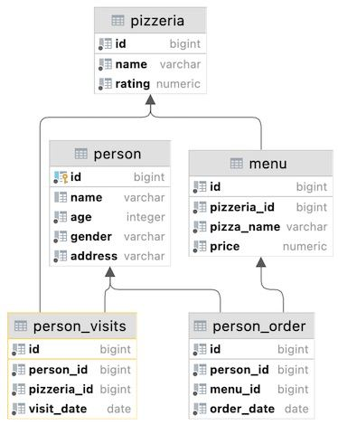

## Task - Global JOIN

**Please write an SQL statement that returns a list of the names of the people who ordered pizza from the corresponding pizzeria. The sample result (with named columns) is provided below and yes ... please make the ordering by 3 columns (`person_name`, `pizza_name`, `pizzeria_name`) in ascending mode.**

RU: Напишите SQL-инструкцию, которая возвращает список имен людей, заказавших пиццу в соответствующей пиццерии. Сделайте вывод результата в 3-х столбцах: `person_name`, `pizza_name`, `pizzeria_name`, отсортируйте в порядке возрастания.

\
*Пример*

\
*Схема*

\
*Решение*