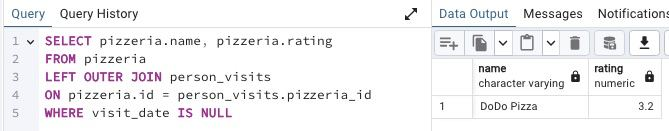

## Task - Move to the LEFT, move to the RIGHT

**Write a SQL statement that returns a list of pizzerias with the corresponding rating value that have not been visited by people.**

RU: Напишите SQL-запрос, который вернет список пиццерий, с соответствующим значением рейтинга, которые не были посещены людьми.

DENIED: NOT IN, IN, NOT EXISTS, EXISTS, UNION, EXCEPT, INTERSECT

\
*Схема*

\
*Решение*