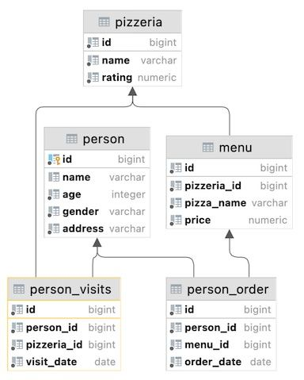

## Task - Find data gaps

**Please write a SQL statement that returns the missing days from January 1 through January 10, 2022 (including all days) for visits by people with identifiers 1 or 2 (i.e., days missed by both). Please order by visit days in ascending mode. The sample data with column names is shown below.**

RU: Напишите SQL-запрос, который возвращает количество дней с 1-01-2022 до 10-01-2022 (включительно), в которые люди с идентификаторами 1 или 2 не приходили. Отсортируйте по `visit_days`. 

DENIED: NOT IN, IN, NOT EXISTS, EXISTS, UNION, EXCEPT, INTERSECT

\
*Пример*

\
*Схема*

\
*Решение*
