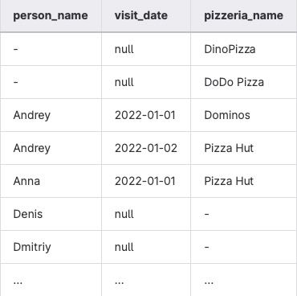
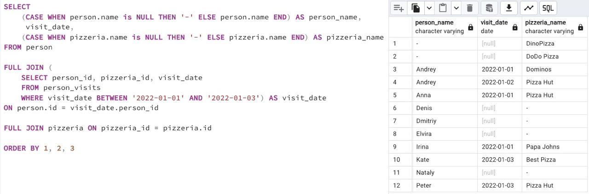

## Task - FULL means ‘completely filled’

**Please write an SQL statement that will return the entire list of `names` of people who visited (or did not visit) pizzerias during the period from January 1 to January 3, 2022 on one side and the entire list of `names of pizzerias` that were visited (or did not visit) on the other side. The data sample with the required column names is shown below. Please note the replacement value '-' for NULL values in the columns `person_name` and `pizzeria_name`. Please also add the order for all 3 columns.**

RU: Напишите SQL-запрос, который возвращает список имен людей, которые посетили (или нет) пиццерии в период с 1 января до 3 января 2022 с одной стороны, и названия этих пиццерий с другой стороны. Для NULL-значений используйте `-`, сделайте сортировку по 3 колонкам.

DENIED: NOT IN, IN, NOT EXISTS, EXISTS, UNION, EXCEPT, INTERSECT

\
*Пример*

\
*Схема*

\
*Решение*