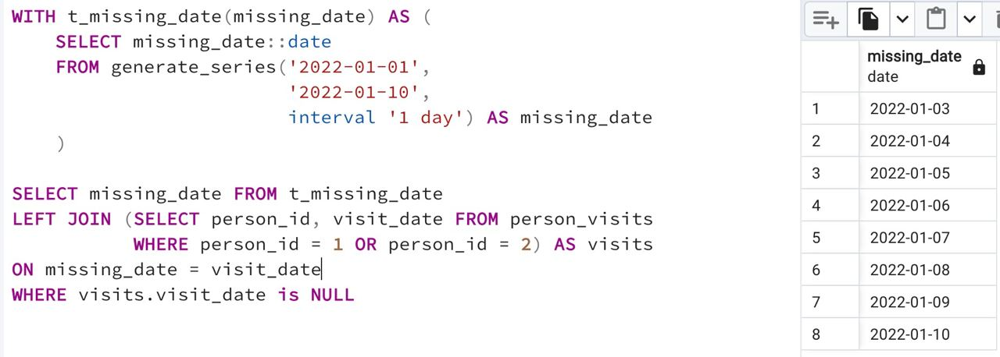

## Task - Reformat to CTE

**Let's go back to Exercise #01, please rewrite your SQL using the CTE (Common Table Expression) pattern. Please go to the CTE part of your "day generator". The result should look similar to Exercise #01.**

RU: Вернитесь к упражнению 1, перепишите SQL-запрос, используя СTE (Common Table Expression). Результат должен выглядить точно так же, как в упражнении 1.

DENIED: NOT IN, IN, NOT EXISTS, EXISTS, UNION, EXCEPT, INTERSECT

\
*Схема*

\
*Решение*