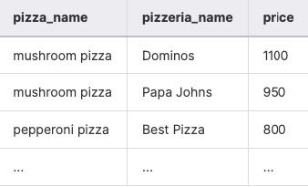
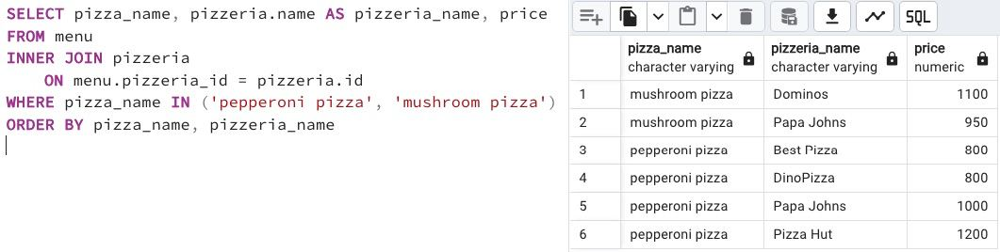

## Task - Find favourite pizzas

**Find complete information about all possible `pizzeria names` and `prices` to get `mushroom` or `pepperoni` pizza. Then sort the result by `pizza name` and `pizzeria name`. The result of the sample data is shown below (please use the same column names in your SQL statement).**

RU: Нужно найти всю информацию о названии пиццерии и цене на грибную пиццу и пепперони пиццу. Отсортировать результат по `pizza name` и `pizzeria name`. Результат должен быть как в примере.

\
*Пример*

\
*Схема*

\
*Решение*