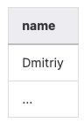
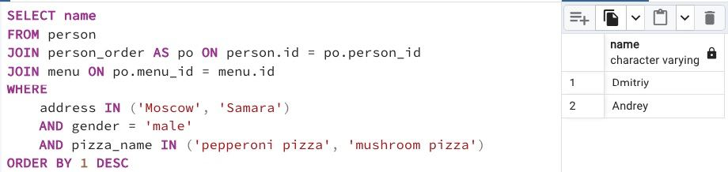

## Task - Continuing to research data

**Please find the names of all men from Moscow or Samara who order either pepperoni or mushroom pizza (or both). Please sort the result by person names in descending order. The sample output is shown below.**

RU: Найдите имена всех мужчин из Москвы или Самары, которые заказывали пиццу пепперони или грибную (или обе). Отсортируйте результат по имени человека в обратном порядке.

\
*Пример*

\
*Схема*

\
*Решение*