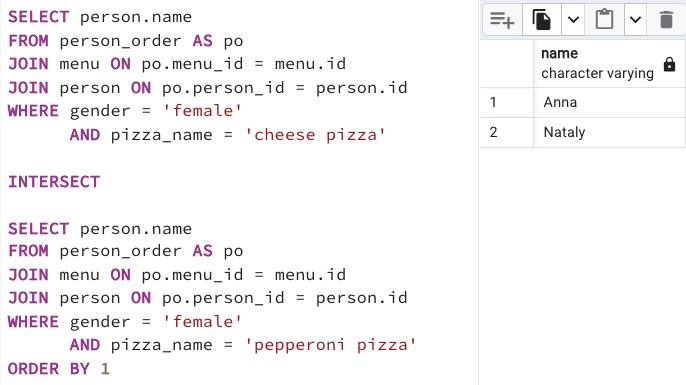

## Task - Who loves cheese and pepperoni?

**Find the names of all women who ordered both pepperoni and cheese pizzas (at any time and in any pizzerias). Make sure that the result is ordered by person's name. The sample data is shown below.**

RU: Найти имена всех женщин, кто заказывал и пиццу пепперони и сырную пиццу (в любое время и в любых пиццериях). Отсортируйте по `person_name`.

\
*Пример*

\
*Схема*

\
*Решение*
