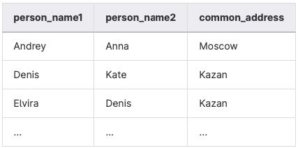

## Task - Find persons from one city

**Find the names of people who live at the same address. Make sure the result is sorted by 1st person's name, 2nd person's name, and shared address. The data sample is shown below. Make sure your column names match the column names below.**

RU: Найти имена людей, которые живут по одному адресу. Отсортировать результат по имени первого человека, второго человека и адресу. 

\
*Пример*

\
*Схема*

\
*Решение*
