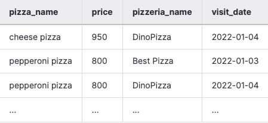
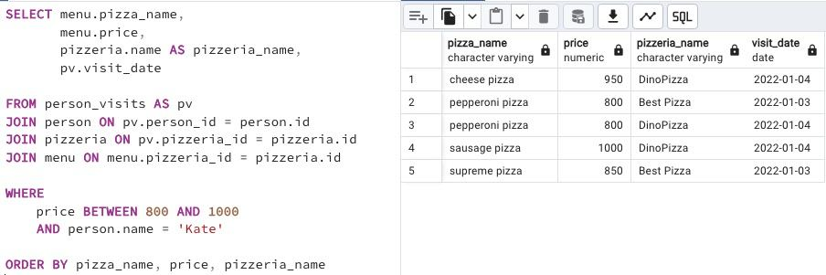

## Task - Let’s find appropriate prices for Kate

**Please write a SQL statement that returns a list of pizza names, pizza prices, pizzeria names, and visit dates for Kate and for prices ranging from 800 to 1000 rubles. Please sort by pizza, price, and pizzeria name. See a sample of the data below.**

RU: Напишите SQL-запрос, который возвращает список `pizza name`, `pizza prices`, `pizzeria names`, `visit dates` для Кейт и для цены от 800 до 1000 за пиццу. Отсортировать по `pizza`, `price`, `pizzeria name`.

\
*Пример*

\
*Схема*

\
*Решение*