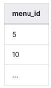
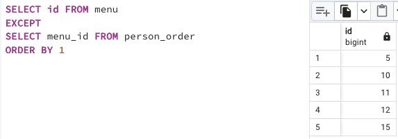

## Task - Let’s find forgotten menus

**Find all menu identifiers that are not ordered by anyone. The result should be sorted by identifier. The sample output is shown below.**

RU: Найти все идентификаторы, которые не были никем заказаны. Результат должен быть отсортирован по идентификатору. 

DENIED: any type of JOINs

\
*Пример*

\
*Схема*

\
*Решение*