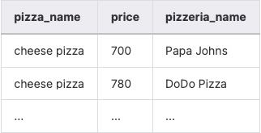

## Task - Let’s find forgotten pizza and pizzerias

**Please use the SQL statement from Exercise #01 and display the names of pizzas from the pizzeria that no one has ordered, including the corresponding prices. The result should be sorted by pizza name and price. The sample output data is shown below.**

RU: Используя SQL-запрос из упражнения 01, отобразите названия пицц из пиццерий, которые не были заказаны, и добавьте соответствующий ценник пиццы. Результат отсортируйте по названию пицце и по ценнику.  

\
*Пример*

\
*Схема*

\
*Решение*