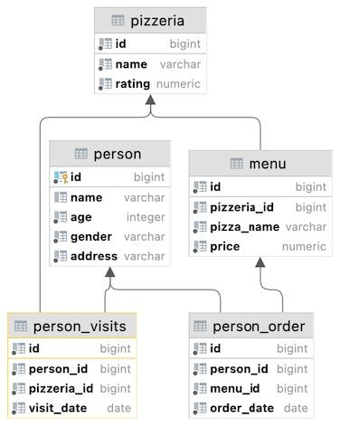

## Task - Let’s compare visits

**Please find pizzerias that have been visited more often by women or by men. Save duplicates for any SQL operators with sets (UNION ALL, EXCEPT ALL, INTERSECT ALL constructions). Please sort a result by the name of the pizzeria. The sample data is shown below.**

RU: Найдите пиццерии, которые были посещены чаще женщинами, либо мужчинами. Используйте конструкции UNION ALL, EXCEPT ALL, INTERSECT ALL. Отсортируйте результат по названию пиццерии.

\
*Пример*

\
*Схема*

\
*Решение*
