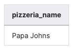
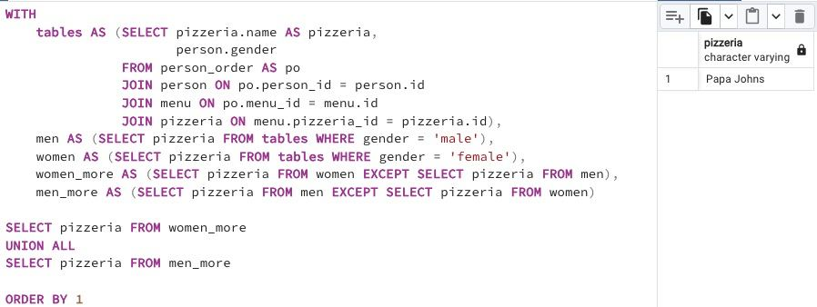

## Task - Let’s compare orders

**Find a union of pizzerias that have orders from either women or men. In other words, you should find a set of names of pizzerias that have been ordered only by women and make "UNION" operation with set of names of pizzerias that have been ordered only by men. Please be careful with word "only" for both genders. For all SQL operators with sets don't store duplicates (UNION, EXCEPT, INTERSECT).  Please sort a result by the name of the pizzeria. The sample data is shown below.**

RU: Найдите объединение пиццерий, в которых есть заказы от женщин и от мужчин. Другими словами, нужно найти названия пиццерий, в которых заказы были сделаны только женщинами и сделать UNION с названиями пиццерий, в которых заказы были сделаны только мужчинами. Не оставляйте в выборке повторы, т.е. используйте UNION, EXCEPT, INTERSECT. Отсортируйте результат по имени пиццерии.

\
*Пример*

\
*Схема*

\
*Решение*