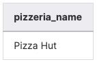
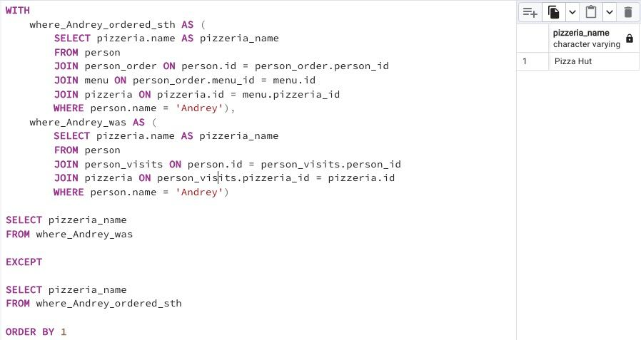

## Task - Visited but did not make any order

**Write an SQL statement that returns a list of pizzerias that Andrey visited but did not order from. Please order by the name of the pizzeria. The sample data is shown below.**

RU: Напишите SQL-запрос, который возвращает список пиццерий, которые были посещены Андреем, но в которых он ничего не заказал. Отсортируйте по имени пиццерии.

\
*Пример*

\
*Схема*

\
*Решение*
