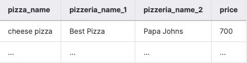
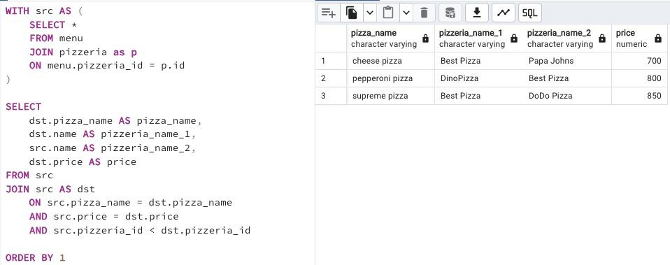

## Task - Find price-similarity pizzas

**Find the same pizza names that have the same price, but from different pizzerias. Make sure that the result is ordered by pizza name. The data sample is shown below. Please make sure that your column names match the column names below.**

RU: Найдите позиции, у которых одно и то же название (пицц), и которые имеют один и тот же ценник, но в разных пиццериях. Отсортируйте результат по названию пиццы.  

\
*Пример*

\
*Схема*

\
*Решение*
