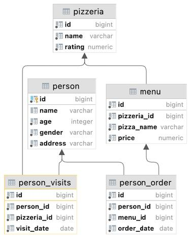
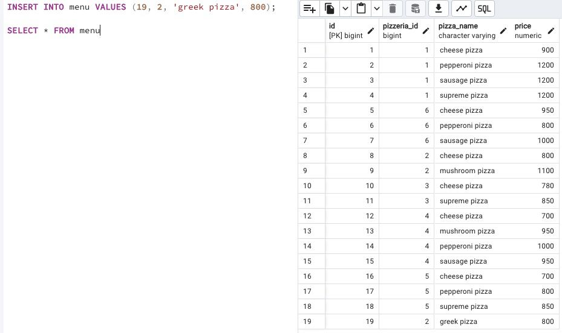

## Task - Let’s cook a new type of pizza

**Please register a new pizza with the name "greek pizza" (use id = 19) with the price of 800 rubles in the restaurant "Dominos" (pizzeria_id = 2).
Warning: this exercise is likely to cause the modification of data in the wrong way. Actually, you can restore the original database model with data from the link.**

RU: Добавьте новую пиццу с названием "греческая" (и id 19), c ценником 800 рублей в ресторан "Dominos" (pizzeria id 2).

\
*Схема*

\
*Решение*
