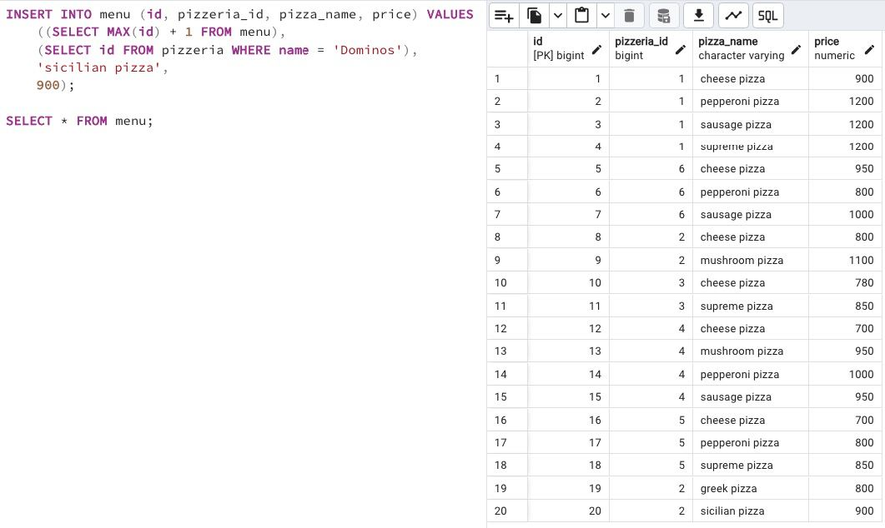

## Task - Let’s cook a new type of pizza with more dynamics

**Please register a new pizza with the name "sicilian pizza" (whose id should be calculated by the formula "maximum id value + 1") with the price of 900 rubles in the restaurant "Dominos" (please use internal query to get the identifier of the pizzeria).
Warning: This exercise is likely to cause the modification of data in the wrong way. Actually, you can restore the original database model with data from the link in the "Rules of the day" section and replay the script from Exercise 07.**

RU: Добавьте новую пиццу (сицилианскую), id которой должен быть посчитан по формуле "максимальный id + 1", с ценником 900 в ресторане Доминос (используйте внутренний запрос для получения идентификатора пиццерии).

DENIED: Don’t use direct numbers for identifiers of Primary Key and pizzeria

\
*Схема*

\
*Решение*
