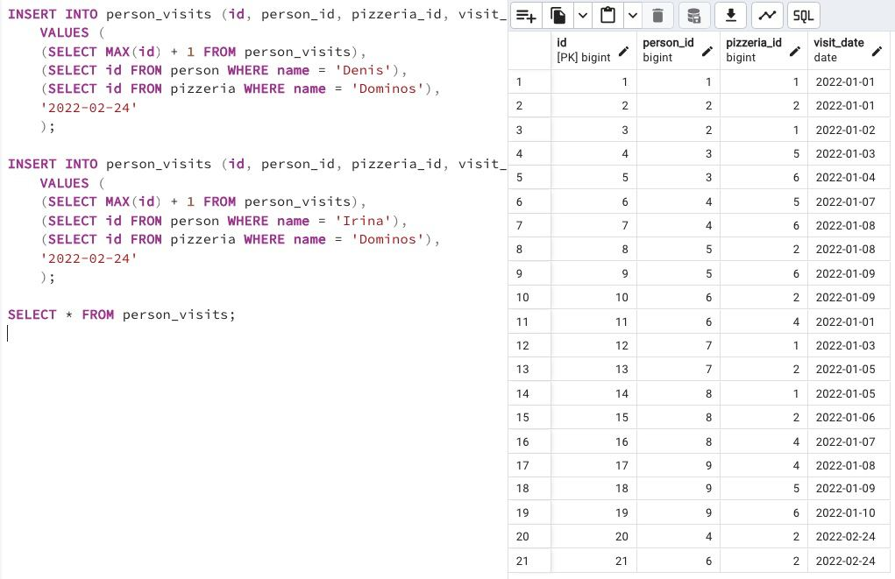

## Task - New pizza means new visits

**Please record new visits to Domino's restaurant by Denis and Irina on February 24, 2022.
Warning: This exercise is likely to cause the modification of data in the wrong way. Actually, you can restore the original database model with data from the link in the "Rules of the Day" section and replay the script from Exercises 07 and 08.**

RU: Запишите новый визит в ресторан Dominos, который совершили Денис и Ирина 24 февраля 2022. 

DENIED: Don’t use direct numbers for identifiers of Primary Key and pizzeria

\
*Схема*

\
*Решение*
