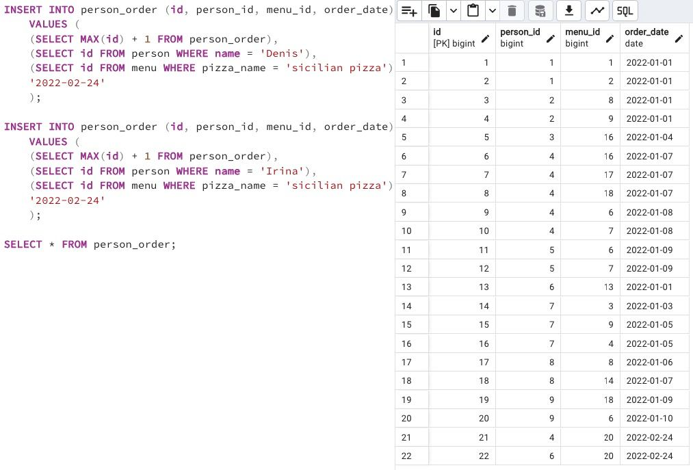

## Task - New visits means new orders

**Please register new orders from Denis and Irina on February 24, 2022 for the new menu with "sicilian pizza".
Warning: This exercise will probably cause you to change data in the wrong way. Actually, you can restore the original database model with data from the link in the Rules of the Day section and replay the script from Exercises 07, 08 and 09.**

RU: Добавьте новый заказ от Дениса и Ирина 24-ого февраля 2022 года для нового меню с "сицилианской пиццей". 

DENIED: Don’t use direct numbers for identifiers of Primary Key and pizzeria

\
*Схема*

\
*Решение*
