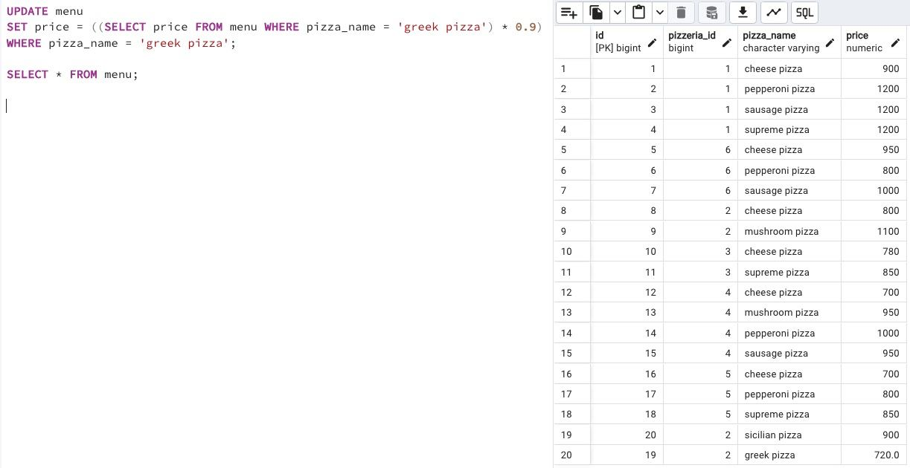

## Task - “Improve” a price for clients

**Please change the price of "greek pizza" to -10% of the current value.
Warning: This exercise is likely to cause you to change data in the wrong way. Actually, you can rebuild the original database model with data from the link in the "Rules of the Day" section and replay the script from Exercises 07, 08, 09, and 10.**

RU: Поменяйте цену "греческой пиццы" на -10% от текущей цены.

\
*Схема*

\
*Решение*
