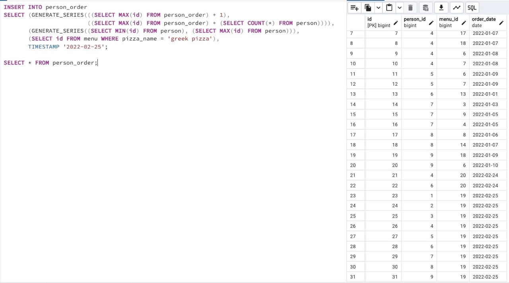

## Task - New orders are coming!

**Please register new orders of all persons for "greek pizza" on February 25, 2022.
Warning: This exercise will probably cause you to change data in the wrong way. Actually, you can restore the original database model with data from the link in the "Rules of the Day" section and replay the script from Exercises 07, 08, 09, 10 and 11.**

RU: Добавьте новый заказ для всех людей для греческой пиццы на 25 февраля 2022.

ALLOWED:
- Please use “insert-select” pattern
- generate_series(...)

DENIED:
- Don’t use direct numbers for identifiers of Primary Key, and menu
- Don’t use window functions like ROW_NUMBER()
- Don’t use atomic INSERT statements 

\
*Схема*

\
*Решение*