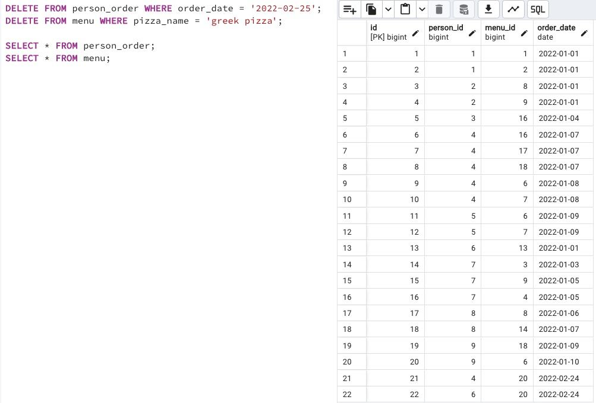

## Task - Money back to our customers

**Write 2 SQL (DML) statements that delete all new orders from Exercise #12 based on the order date. Then delete "greek pizza" from the menu.
Warning: This exercise is likely to cause you to modify data in the wrong way. Actually, you can rebuild the original database model with data from the link in the "Rules of the Day section" and replay the script from Exercises 07, 08, 09, 10, 11, 12, and 13.**

RU: Напишите 2 SQL (DML) запроса, которые удаляют все ноые заказы из упражнения 12, основываясь на дате заказа. Затем удалите греческую пиццу из меню.

\
*Схема*

\
*Решение*