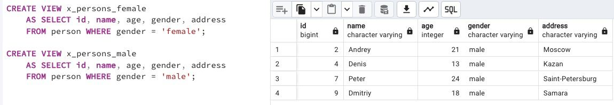

## Task - Let’s create separated views for persons

**Please create 2 Database Views (with similar attributes as the original table) based on a simple filtering by gender of persons. Set the corresponding names for the database views: v_persons_female and v_persons_male.**

RU: Создайте 2 DB-представления (со схожими атрибутами, как в оригинальной таблице), основываясь на простой фильтрации по гендеру человека. Установите следующие названия для представлений: `v_persons_female` и `v_persons_male`.

\
*Схема*

\
*Решение*
