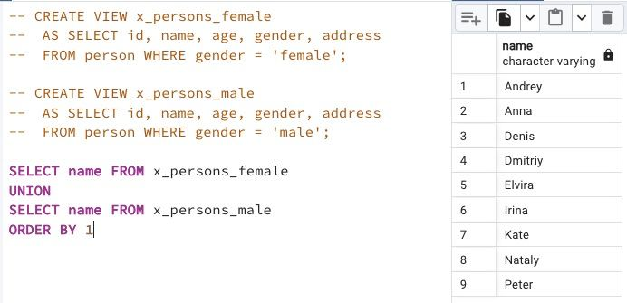

## Task - From parts to common view

**Please use 2 Database Views from Exercise #00 and write SQL to get female and male person names in one list. Please specify the order by person name. The sample data is shown below.**

RU: Используя 2 представления из упражнения 00, напишите SQL-запрос, чтобы получить имена женщин и мужчин в одном списке. Отсортируйте по имени.

\
*Пример*

\
*Схема*

\
*Решение*