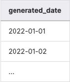
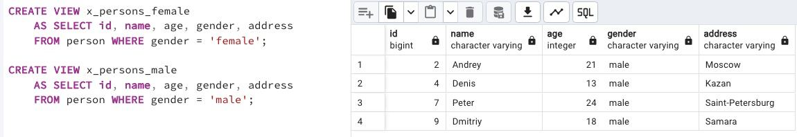

## Task - "Store" generated dates in one place

**Please create a Database View (with name v_generated_dates) which should "store" generated dates from January 1st to January 31st, 2022 in type DATE. Don't forget the order of the generated_date column.**

RU: Cоздайте DB-представление (с названием v_generated_dates), которое хранит сгенерированные даты с 1 января 2022 до 31 января 2022 с типом данных DATE. Отсортируйте по generated_date колонке.

ALLOWED: generate_series(...)

\
*Пример*

\
*Схема*

\
*Решение*