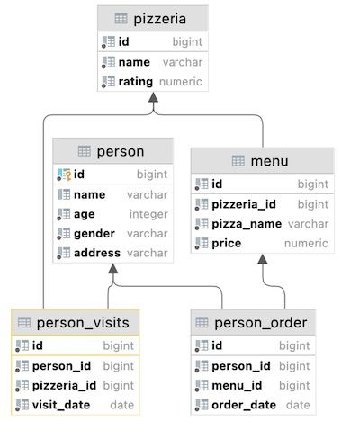

## Task - Find missing visit days with Database View

**Write a SQL statement that returns missing days for people's visits in January 2022. Use the `v_generated_dates` view for this task and sort the result by the missing_date column. The sample data is shown below.**

RU: Напишите SQL-запрос, который возвращает дни, в которые люди не посещали в январе пиццерии в 2022. Используйте представление `v_generated_dates` для этого задания и отсортируйте результат по колонке `missing_date`. 

\
*Пример*

\
*Схема*

\
*Решение*