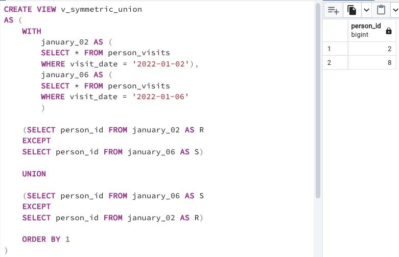

## Task - Let’s find something from Set Theory

**Write an SQL statement that satisfies the formula `(R - S)∪(S - R)` .
Where R is the `person_visits` table with a filter through `January 2, 2022`, S is also the `person_visits` table but with a different filter through `January 6, 2022`. Please do your calculations with sets under the `person_id` column and this column will be alone in a result. Please sort the result by the person_id column and present your final SQL in the `v_symmetric_union` (*) database view.
(*) To be honest, the definition of "symmetric union" doesn't exist in set theory. This is the author's interpretation, the main idea is based on the existing rule of symmetric difference.**

RU: Напишите SQL-запрос, которая удовлетворяет формуле `(R - S) ∪ (S - R)`. Где R - это таблица `person_visits` с фильтром по 2 январю 2022. S - это так же таблица `person_visits`, но с другим фильтром, по 6 январю 2022. Вычисления должны быть в столбце `person_id`, и этот столбец должен быть единственным в результате. Отсортируйте результат по колонке `person_id` и представьте свой окончательный вариант в представлении "симметричного объединения". 

\
*Схема*

\
*Решение*