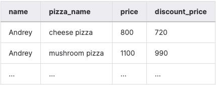
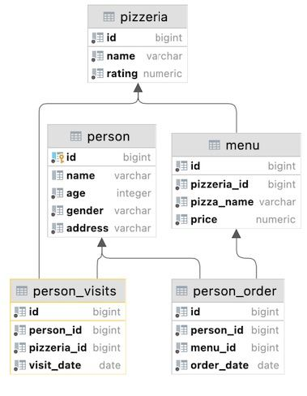
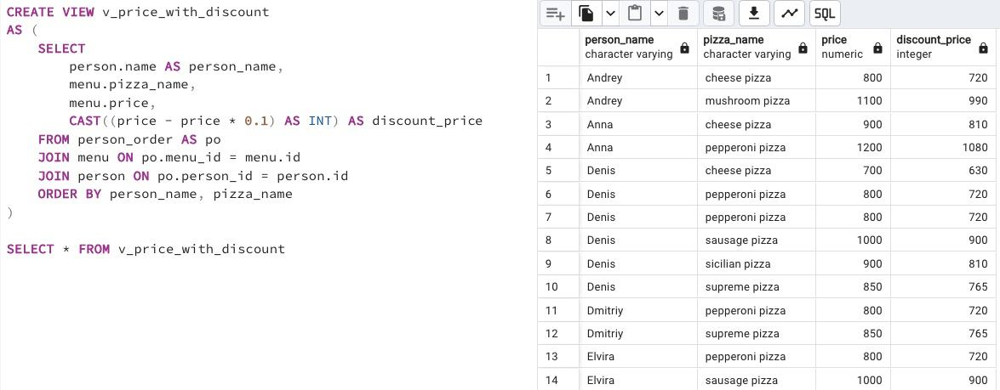

## Task - Let’s calculate a discount price for each person

**Please create a Database View `v_price_with_discount` that returns the orders of a person with person name, pizza name, real price and calculated column `discount_price` (with applied 10% discount and satisfying formula price - price*0.1). Please sort the result by person names and pizza names and convert the discount_price column to integer type. See a sample result below.**

RU: Создайте представление БД `v_price_with_discount`, которое возвращает заказы людей с именем человека, названием пиццы, ценой и рассчитанной колонкой `discount_price` (с примененной 10%-скидкой и соответствующей формуле `price - price * 0.1`). Отсортируйте результат по имени человека и названию пиццы и конвертируйте колонку `discount_price` в тип int. 

\
*Пример*

\
*Схема*

\
*Решение*