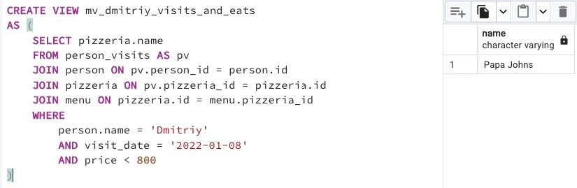

## Task - Materialization from virtualization

**Please create a Materialized View `mv_dmitriy_visits_and_eats` (with data included) based on the SQL statement that finds the name of the pizzeria where Dmitriy visited on January 8, 2022 and could eat pizzas for less than 800 rubles (this SQL can be found at Day #02 Exercise #07).
To check yourself, you can write SQL to the Materialized View mv_dmitriy_visits_and_eats and compare the results with your previous query.**

RU: Cоздайте материализованное представление `mv_dmitriy_visits_and_eats`, которое основано на SQL-запросе, которое находит названия пиццерий, где Дмитрий был 8 января 2022 и где мог съесть пиццу менее чем за 800 рублей (этот SQL запрос может быть найден в дне 02, упражнении 07). Чтобы проверить себя, можно написать SQL заново и сравнить с предыдущим.

\
*Схема*

\
*Решение*