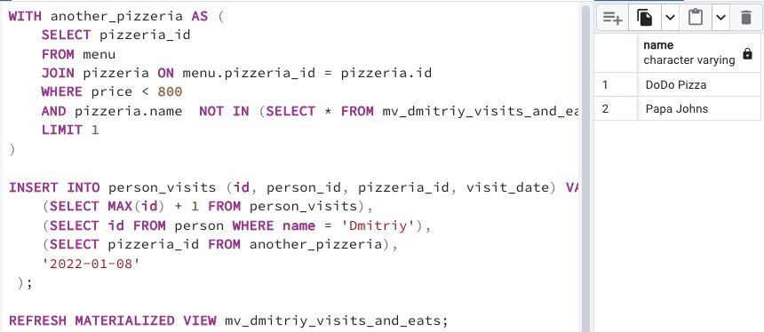

## Task - Refresh our state

**Let's refresh the data in our Materialized View `mv_dmitriy_visits_and_eats` from Exercise #06. Before this action, please create another Dmitriy visit that satisfies the SQL clause of the Materialized View except pizzeria, which we can see in a result from Exercise #06.
After adding a new visit, please update a data state for mv_dmitriy_visits_and_eats.**

RU: В этом задании нужно использовать представление `mv_dmitriy_visits_and_eats` из упражнения 06. До этого создайте еще один визит Дмитрия, который удовлетворяет представлению из 06 задания во всем, кроме пиццерии. После добавления нового визита, обновите данные в представлении `mv_dmitriy_visits_and_eats`.

DENIED: Don’t use direct numbers for identifiers of Primary Key, person and pizzeria

\
*Схема*

\
*Решение*